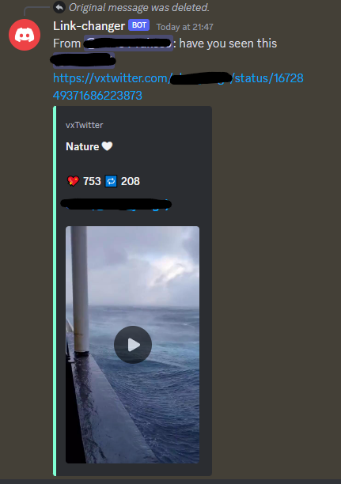

<h1>Link Changer Discord Bot</h1>

This bot has function to automatically change twitter, instagram, and tiktok url for embed video. I'm using 
<a href="https://github.com/Wikidepia/InstaFix">https://github.com/Wikidepia/InstaFix</a> for instagram,
<a href="https://github.com/Britmoji/tiktxk">https://github.com/Britmoji/tiktxk</a> for tiktok and
<a href="https://github.com/dylanpdx/BetterTwitFix">https://github.com/dylanpdx/BetterTwitFix</a> for twitter. Credits to those three.

<h2>Installation</h2>

<ol>
  <li>Clone the repository:</li>
  <pre><code>git clone https://github.com/bimprakosoo/link-changer-bot.git</code></pre>
  <li>Navigate to the project directory:</li>
  <pre><code>cd your-repo</code></pre>
  <li>Install dependencies:</li>
  <pre><code>npm install</code></pre>
</ol>

<h2>Configuration</h2>
<ol>
  <li>Install dotenv:</li>
  <pre><code>npm i -G dotenv</code></pre>
  <li>Create a `.env` file in the root directory of the project and add your own discord token: </li>
  <pre><code>DISCORD_TOKEN=your-discord-token</code></pre>
</ol>

<h2>Usage</h2>

To start the bot, run the following command (make sure you're inside src folder):

<pre><code>node main.js</code></pre>

After running the bot, to try it just copy the url from twitter, instagram, or tiktok. The bot will automatically reply with modified url.

<h2>Contributing</h2>

Contributions are welcome! If you have any suggestions or improvements, feel free to open an issue or submit a pull request.

